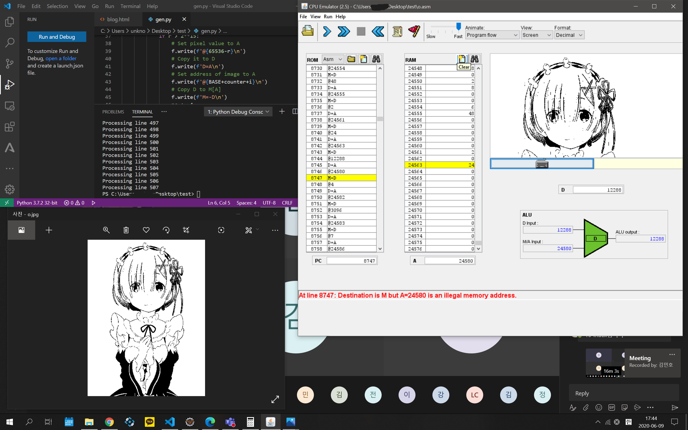
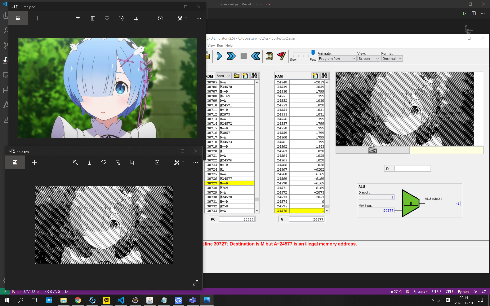

# Img2hack.asm
 A python script that convert iamage to nand2tetris HACK asm code.
## [Gen.py](./Gen.py)
1. Resize image so that generated code would not be too large.
2. Convert it to grayscale.
3. Binarization it with Otsu's thresholding method.
4. Convert it to hack asm code.
## [Advanced.py](./Advanced.py)
1. Resize image so that generated code would not be too large.
2. Convert it to grayscale.
3. Convert grayscale to grayscale-looks like black-white image.
4. Convert it to hack asm code.
## Detail of Step 3 of Advanced.py
First, Divide grayscale image into some cluster. For example, by doing ``image//=(256//7)``, you can divide image into seven cluster. For low contrast image, histogram normalization required.

Second, generate a tone map. The tone map is a 2D numpy uint8 array that has same size as the original image. It is filled with given patter : [0,1,2,3,4...,N-1,0,1,2,3,4,...,N-1...,...,...,], N is the number of clusters.
Actually, if you do this, the image will have vertical lines, so shift 3 pixels for each row.

Then, the original image is compared with the tone map. so, if the value of a pixel in image is higher than the pixel of tone map, set the value of given pixel to 255, else, set it to 0.

This can be thought of as subtracting the tone map from the original image, and then performing binarization with threshold=0.
## Result
### Result of [Gen.py](./Gen.py)
You can see the given image is shown in the program.

After the given image is converted to a black and white image that looks like grayscale, it is displayed on the program screen.
### Result of Advanced.py

